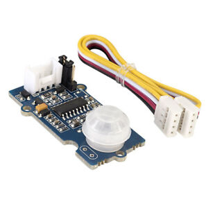
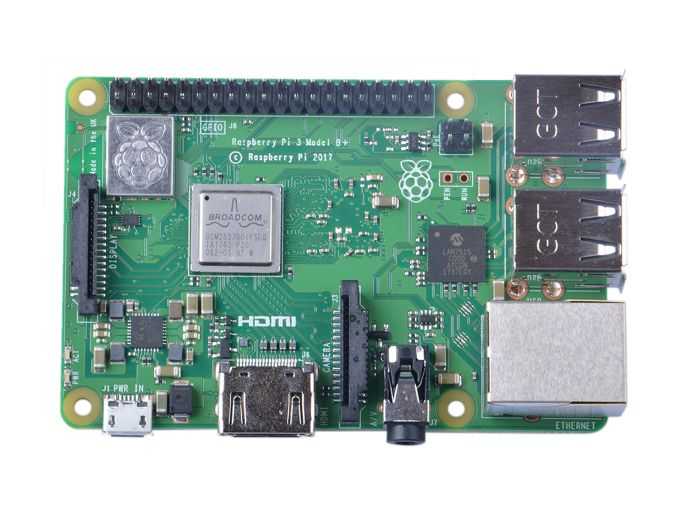

# PIR Motion Sensor Build Instructions for the LumiMonitor

## Table of Contents
[Introduction](https://github.com/KyleV1999/LumiMonitor#Introduction)

[Budget](https://github.com/KyleV1999/LumiMonitor#Budget)

[Time Commitment](https://github.com/KyleV1999/LumiMonitor#Time%20Comitment)

[Setting Up Your Platform](https://github.com/KyleV1999/LumiMonitor#Setting%20Up%20Your%20Development%20Platform)


## Introduction

This is the build instructions for building the PIR Motion sensor as part of the LumiMonitor project. The PIR (Passive Infared) Motion Sensor will detect motion within 3 meters of the sensor. These instuction will show you how to design and build the breadboard and PCB circuits to intigrate the sensor with a Broadcom Development Platform (Raspberry Pi 3B+). I will also provide a list of materials and links to where you can buy them, as well as a Corel Draw file so that you can laser cut a case out of clear acrylic. These instutions take into account that you will have access to equipment such as a soldering iron, laser cutter, wire strippers, etc. The PIR Motion Sensor will be used in the final Lumi Monitor project to intiate hands-free data collection. The photo below depicts the final product:


Before you begin some skills you will need duing the build of this project include:
* Basic electrical and circuit knowledge
* Basic programming knowledge
  * This project specifically was programmed in Python
* Basic understanding of the Raspberry Pi and Linux based operating systems
* Soldering

## Budget
Thse are the parts needed to complete the project. Displayed below are links and price breakdown for each component.

**Parts for Lumi Monitor**

| Part   | Source  | Part Number | # of Units | Price Per Unit (CAD)  | Taxes & Shipping (CAD) | Subtotal  | Link |
| ------ | ------- | ----------- | --------------- | --------------- | ---------------------- | --------- | ---- |
| Raspberry Pi 3 B+ Motherboard | Amazon | 3BPLUS-R | 1 | $55.97 | $7.28 | $63.25 | https://amzn.to/2kMYDtb |
| Grove ‐ PIR Motion Sensor | Digikey | 101020020 | 1 | $11.56 | $8.35 | $19.91 | https://bit.ly/2kKx8QV | 
| Seeedstudio Grove 4-pin Connector (10) | robotshop.com | RB-See-204 | 1 | $1.33 | $9.01 | $11.67 | https://bit.ly/32it9vh |
| Breakaway PCB Board Header Connector | Amazon | ODYF162934WAZR85384 | 1 | $12.80 | $4.18 | $16.98 | https://amzn.to/37IDlAd |
| Elegoo 120pcs Multicolored Dupont Wire | Amazon | EL-CP-004 | 1 | $11.95 | $4.36 | $16.31 | https://amzn.to/2qHYRop |
| Kingston 32 GB Micro SD Card | Walmart | SDCS/32GBCR | 1 | $11.98 | $2.98 | $14.96 | https://bit.ly/2souG61 / In Store |
| AmazonBasics USB 3.0 to Ethernet Adapter | Amazon | AE3101X1 | 1 | $20.05 | $4.53 | $24.58 | https://amzn.to/2Nwrq0A |
| 3ft Ethernet Cable| PrimeCables.ca | | 1 | $1.24 | $6.88 | $8.12 | https://bit.ly/2QYcxGe |
| Raspberry Pi Micro USB Power Supply | Amazon |DCAR-RSP-2A5 | 1 | $11.99 | $6.36 | $18.35 | https://amzn.to/2skohZp |
| Clear Acrylic Glass 3mm | Amazon | | 1 | $17.09 | $0.00 | $17.09 | https://amzn.to/2XWM1OX |
| M2.5 Screws | Digikey | | 4 | $0.15 | $0.00 | $0.60 | https://bit.ly/2Oy8TS9 |
| Lead Free Solder | Amazon | 2-CA-X | 1 | $15.99 | $4.32 | $20.31 | https://amzn.to/37JXLJj |
| Total Cost | $232.13 |
| Total Tax & Shipping | $58.25 | 

**Below are images for major components used:**

Grove PIR Motion Sensor - Sensor



Broadcom Development Platform / Raspberry Pi 3B+



Grove Headers - Used to connect sensor to PCB


AmazonBasics USB 3.0 to Ethernet Adapter - Used for SSH and remote desktop connection with development platform


## Time Commitment

When I put together this project, I did it in a period of 14 weeks. The schedual that I followed to complete the project is shown below. However, this project can most likely be done in the matter of a weekend, granted that all the parts needed have been delivered, you have your PCB made and that you have access to all the required equipment needed to complete the project.


**Estimate Time:**

* Setting up your development platform - 45 Minutes
* Breadboard Assembly & Testing - 25 Minutes
* PCB Soldering - 30 Minutes
* PCB Powerup - 5 Minutes
* Laser Cut Case - 20 Minutes
* Assemble Case w/ Development Platform & Sensor - 25 Minutes
* Final Testing & Troubleshooting - 20 Minutes

**Total Estimated Time: 170 Minutes or 2 Hours and 50 Minutes**

## Setting Up Your Development Platform
The very first step of the project would be to setup your Raspberry Pi 3B+ with the latest kernal of Raspian. If you are new to Raspberry Pi's, I would reccommend doing this through NOOBS (New Out Of the Box Software) operating system installer. I've made this tutorial video on how to do this: [How To Install NOOBS Onto A Raspberry Pi (3B+/4)](https://youtu.be/TlQxaEdyBgM).

### Setting Up SSH

Once your Raspberry Pi has been configured with an operating system, remote desktop and SSH should be configured so that you can connect to the Pi through USB to Ethernet rather than displaying the Pi on a external display through an HDMI cable. 

To setup SSH, begin by opening the terminal by pressing CTRL+ALT+T on the keyboard. Next, use the command ```sudo raspi-config```. An interface similar to as show below should appear. Using the up and down arrow keys select interfacing options and press ENTER.


Next, use the up and down arrow keys to select SSH and hit enter.


Finally, using the right and left arrow keys select <Yes>. SSH has now been successfully enabled.


Now, plug in one end of the ethernet cable into the Raspberry Pi and the other end into the adapter. Plug the USB end of the adapter into a PC. Next use the ```ifconfig``` command to retrieve the IPv4 address of the Pi's ethernet interface. In my case it is 169.254.123.117.


Now use and SSH client like [PuTTY](https://www.chiark.greenend.org.uk/~sgtatham/putty/latest.html). Enter the IPv4 address then press open. You should be prompted with a login. Enter your Pi's username and password. Finally, you should be able to control the terminal of your Raspberry Pi through SSH.


### Setting Up Remote Desktop


