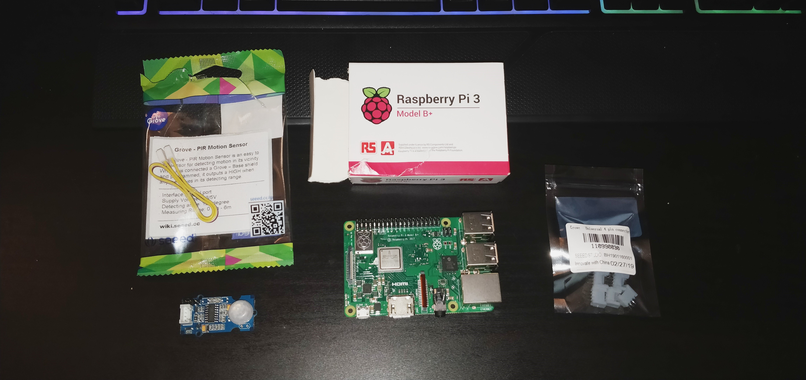
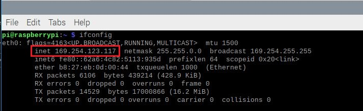
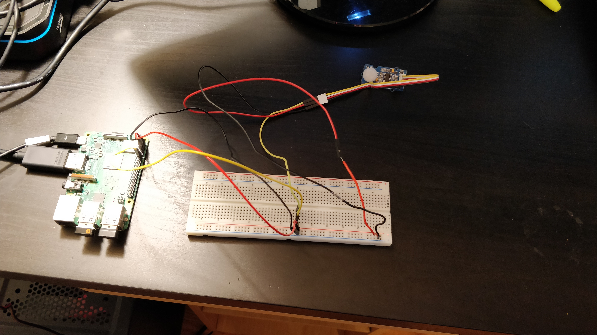
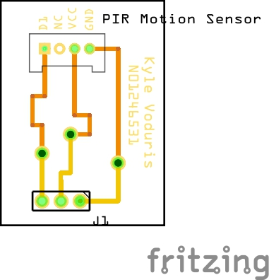

# PIR Motion Sensor Build Instructions for the LumiMonitor

## Table of Contents
* [Introduction](https://github.com/KyleV1999/LumiMonitor#Introduction)
* [Budget](https://github.com/KyleV1999/LumiMonitor#Budget)
* [Time Commitment](https://github.com/KyleV1999/LumiMonitor#Time-Commitment)
* [Setting Up Your Platform](https://github.com/KyleV1999/LumiMonitor#Setting-Up-Your-Development-Platform)
* [Mechanical Assembly](https://github.com/KyleV1999/LumiMonitor#Mechanical-Assembly)
* [PCB Soldering](https://github.com/KyleV1999/LumiMonitor#PCB-Soldering)
* [Case](https://github.com/KyleV1999/LumiMonitor#Case)
* [Power Up](https://github.com/KyleV1999/LumiMonitor#Power-Up)
* [Production Testing](https://github.com/KyleV1999/LumiMonitor#Production-Testing)


## Introduction

This is the build instructions for building the PIR Motion sensor as part of the LumiMonitor project. The PIR (Passive Infared) Motion Sensor will detect motion within 3 meters of the sensor. These instuction will show you how to design and build the breadboard and PCB circuits to intigrate the sensor with a Broadcom Development Platform (Raspberry Pi 3B+). I will also provide a list of materials and links to where you can buy them, as well as a Corel Draw file so that you can laser cut a case out of clear acrylic. These instutions take into account that you will have access to equipment such as a soldering iron, laser cutter, wire strippers, etc. The PIR Motion Sensor will be used in the final Lumi Monitor project to intiate hands-free data collection. The photo below depicts the final product:


### System Diagram


Before you begin some skills you will need duing the build of this project include:
* Basic electrical and circuit knowledge
* Basic programming knowledge
  * This project specifically was programmed in Python
* Basic understanding of the Raspberry Pi and Linux based operating systems
* Soldering

## Budget
Thse are the parts needed to complete the project. Displayed below are links and price breakdown for each component.

### Parts for Lumi Monitor

| Part   | Source  | Part Number | # of Units | Price Per Unit (CAD)  | Taxes & Shipping (CAD) | Subtotal  | Link |
| ------ | ------- | ----------- | --------------- | --------------- | ---------------------- | --------- | ---- |
| Raspberry Pi 3 B+ Motherboard | Amazon | 3BPLUS-R | 1 | $55.97 | $7.28 | $63.25 | https://amzn.to/2kMYDtb |
| Grove ‐ PIR Motion Sensor | Digikey | 101020020 | 1 | $11.56 | $8.35 | $19.91 | https://bit.ly/2kKx8QV | 
| Seeedstudio Grove 4-pin Connector (10) | robotshop.com | RB-See-204 | 1 | $1.33 | $9.01 | $11.67 | https://bit.ly/32it9vh |
| Breakaway PCB Board Header Connector | Amazon | ODYF162934WAZR85384 | 1 | $12.80 | $4.18 | $16.98 | https://amzn.to/37IDlAd |
| Elegoo 120pcs Multicolored Dupont Wire | Amazon | EL-CP-004 | 1 | $11.95 | $4.36 | $16.31 | https://amzn.to/2qHYRop |
| Kingston 32 GB Micro SD Card | Walmart | SDCS/32GBCR | 1 | $11.98 | $2.98 | $14.96 | https://bit.ly/2souG61 / In Store |
| AmazonBasics USB 3.0 to Ethernet Adapter | Amazon | AE3101X1 | 1 | $20.05 | $4.53 | $24.58 | https://amzn.to/2Nwrq0A |
| 3ft Ethernet Cable| PrimeCables.ca | | 1 | $1.24 | $6.88 | $8.12 | https://bit.ly/2QYcxGe |
| Raspberry Pi Micro USB Power Supply | Amazon |DCAR-RSP-2A5 | 1 | $11.99 | $6.36 | $18.35 | https://amzn.to/2skohZp |
| Clear Acrylic Glass 3mm | Amazon | | 1 | $17.09 | $0.00 | $17.09 | https://amzn.to/2XWM1OX |
| M2.5 Screws | Digikey | | 4 | $0.15 | $0.00 | $0.60 | https://bit.ly/2Oy8TS9 |
| Lead Free Solder | Amazon | 2-CA-X | 1 | $15.99 | $4.32 | $20.31 | https://amzn.to/37JXLJj |
| Total Cost | $232.13 |
| Total Tax & Shipping | $58.25 | 

**Below is an image that contains all the major parts for the project; The Grove PIR Motion Sensor, Raspberry Pi 3B+ and Grove Sockets.**




## Time Commitment

When I put together this project, I did it in a period of 14 weeks. The schedual that I followed to complete the project is shown below. However, this project can most likely be done in the matter of a weekend, granted that all the parts needed have been delivered, you have your PCB made and that you have access to all the required equipment needed to complete the project.


**Estimate Time:**

* Setting up your development platform - 45 Minutes
* Breadboard Assembly & Testing - 25 Minutes
* PCB Soldering - 30 Minutes
* PCB Powerup - 5 Minutes
* Laser Cut Case - 20 Minutes
* Assemble Case w/ Development Platform & Sensor - 25 Minutes
* Final Testing & Troubleshooting - 20 Minutes

**Total Estimated Time: 170 Minutes or 2 Hours and 50 Minutes**

## Setting Up Your Development Platform
The very first step of the project would be to setup your Raspberry Pi 3B+ with the latest kernal of Raspian. If you are new to Raspberry Pi's, I would reccommend doing this through NOOBS (New Out Of the Box Software) operating system installer. I've made this tutorial video on how to do this: [How To Install NOOBS Onto A Raspberry Pi (3B+/4)](https://youtu.be/TlQxaEdyBgM).

### Setting Up SSH

Once your Raspberry Pi has been configured with an operating system, remote desktop and SSH should be configured so that you can connect to the Pi through USB to Ethernet rather than displaying the Pi on a external display through an HDMI cable. 

To setup SSH, begin by opening the terminal by pressing CTRL+ALT+T on the keyboard. Next, use the command ```sudo raspi-config```. An interface similar to as show below should appear. Using the up and down arrow keys select interfacing options and press ENTER.


Next, use the up and down arrow keys to select SSH and hit enter.


Finally, using the right and left arrow keys select Yes. SSH has now been successfully enabled.


Now, plug in one end of the ethernet cable into the Raspberry Pi and the other end into the adapter. Plug the USB end of the adapter into a PC. Next use the ```ifconfig``` command to retrieve the IPv4 address of the Pi's ethernet interface. In my case it is 169.254.123.117.



Now use and SSH client like [PuTTY](https://www.chiark.greenend.org.uk/~sgtatham/putty/latest.html). Enter the IPv4 address then press open. You should be prompted with a login. Enter your Pi's username and password. Finally, you should be able to control the terminal of your Raspberry Pi through SSH.


### Setting Up Remote Desktop
To enable remote desktop to connect and control the Raspberry Pi with a graphical user interface, open up the terminal on the Pi and enter the following commands:

```sudo apt-get install tightvncserver```

```sudo apt-get install xrdp```

After that make sure that your Raspberry Pi is connected to a PC with the ethernet cable and USB to ethernet adapter. Now open "Remote Desktop" on the PC and put in the IPv4 address found earlier and click connect. Enter your Pi's login information and finally, you should be in the remote desktop environment.


## Mechanical Assembly
Now that your development platform has been setup, you should have your PCB made. Provided below are two [fritzing](https://fritzing.org/home/) files:

[Fritzing File With Development Platform](Electronics/LumiMonitor_MotionSensor.fzz)

[Fritzing File With Headers](LumiMonitor_MotionSensor2.fzz)

[Fritzing File With Development Platform](Electronics/LumiMonitor_MotionSensor.fzz) is the breadboard pictorial, schematic diagaram and PCB diagram that describes the connection between the sensor and the development platform. [Fritzing File With Headers](LumiMonitor_MotionSensor2.fzz) shows the connections with the header. Use this file to generate a Gerber file which is to be used to make your PCB.

Before you start soldering the PCB, it would be a good idea to test out that your components and development platform are functioning correctly by building the circuit on a breadboard. Below is and image of the breadboard pictorial and schematic diagram of the circuit.


One thing to keep in mind when breadboarding is that the pins on the Grove socket, for the motion sensor, are too close together to fit on the breadboard. To get around this, stick wires directly into the header of the sensor's wire, then place each wire individually onto the breadboard. 

* Pin 2 (5V) of the Raspberry Pi should be connected to the positive side of the breadboard.
* Pin 6 (GND) of the Raspberry Pi should be connected to the negative side of the breadboard.
* The red (VCC) wire from the motion sensor should be connected to the positive side of the breadboard.
* The black (GND) wire from the motion sensor should be connected to the negativeside of the breadboard.
* The yellow (D1) wire from the motion sensor should be connected to breadboard.
* Pin 12 (BCM 18) of the Raspberry Pi should be connected to the D1 from the sensor on the breadboard.

[pinout.xyz](https://pinout.xyz/) is a good reference for the Raspberry Pi's pin layout. When you finish breadboarding, it should look something like the image below.



Now test to see if the motion sensor is working. [Upload this code to your Pi](Software/motion.py). This is a Python script which will detect HIGH (if motion is detected) and LOW (if no motion is detected). To run the code, open the terminal and make sure that you are in the same directory as your code. Use the command ```python motion.py``` to run the script. If motion is detected, "Motion detected" should be printed out on the screen. If no motion is detected then "No motion detected" is printed. When the sensor detects motion it will stay in a HIGH state for 1 second.


## PCB Soldering

If this is your first time soldering, I would recommend that you watch this tutorial before you begin: [Beginner how to Solder](https://www.youtube.com/watch?v=oqV2xU1fee8). Below is a PCB Diagram from fitzing along with images of the front and back sides of the PCB before anything is soldered.



### Front of PCB


### Back of PCB


1. The first step in soldering the PCB would be to solder the female header. For this project you only need three sockets to connect to the Pi. Before soldering cut the longer header into three sockets with an exacto knife. The pins of the header should be soldered facing the front of the PCB.

1. Next, Solder the Grove socket to the PCB. The pins of the socket should be facing the bottom on the PCB.

1. Finally, you will need to solder the via's / through holes to connect the front side of the board to the back. This can be done by stripping a wire and applying solder to both sides of the hole. 

An example of the final product is shown below:

### Front


### Back


### With Sensor Connected


## Case

Here is a link to the [Corel Draw](Mechanical/KylePi2CaseX6.cdr) file that will be used to lase cut the case. This is a modified design from which the original design can be found [here](https://github.com/diy-electronics/raspberrypi-b-plus-case).

Two slits were made, which is used to slide in the PCB and sensor to keep them in place. A window was also placed a the top to make it easier for the sensor to detect motion. There are screw holes at the bottom of the case to keep the development platform in place and all I/O are accessable.


## Power Up

Before you enclose your PCB and sensor into the case, It would be a good idea to power it up to see if your PCB soldering was successful. It is easier to do this outside of the case to make adjustments if needed. Plug the VCC, GND and D1 wires from the feamale socket on the PCB intro their correct pins on the Raspberry Pi and and plug the sensor into it's socket. Power up the Raspberry Pi and connect to it via SSH. Run the same code from before with the command ```python motion.py```. If everything is working correctly then "Motion Detected" will be displayed when motion is detected. **Warning do not leave the powered up project unattended just in case something goes wrong!** Finally, Once everything has been testedd and is working correctly, enclose you project in the case.

## Production Testing
When testing in a production environment, a PCB should be made for testing the sensor. This is because the dedicated socket for my sensor will not fit on a breadboard and it's simpiler and quicker to just plug the sensor into the socket to test it. Also a dedicated Raspbarry Pi with the all the software installed should be on hand. This is so any PCB or sensor can be swiftly connected, and tested in a matter of a few minutes.   

[Back To Top](https://github.com/KyleV1999/LumiMonitor#pir-motion-sensor-build-instructions-for-the-lumimonitor)


