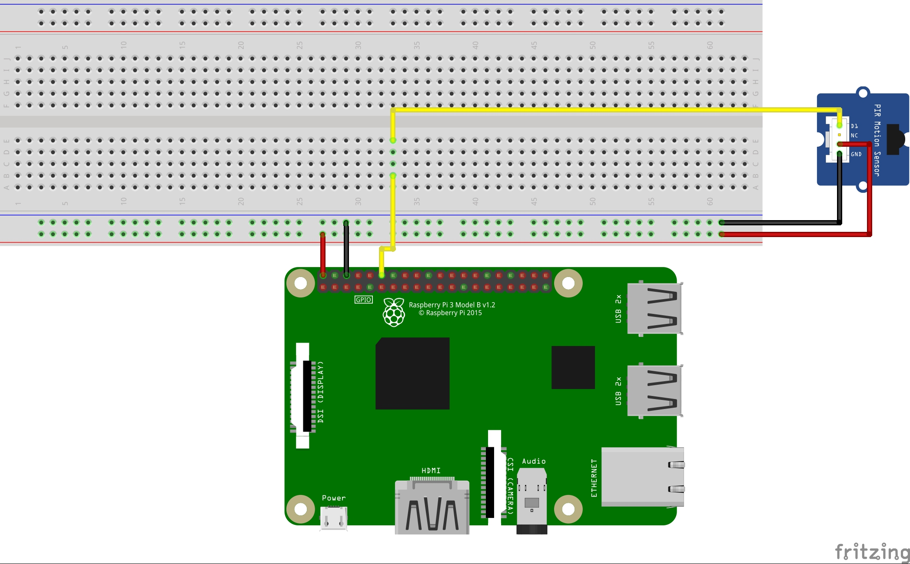
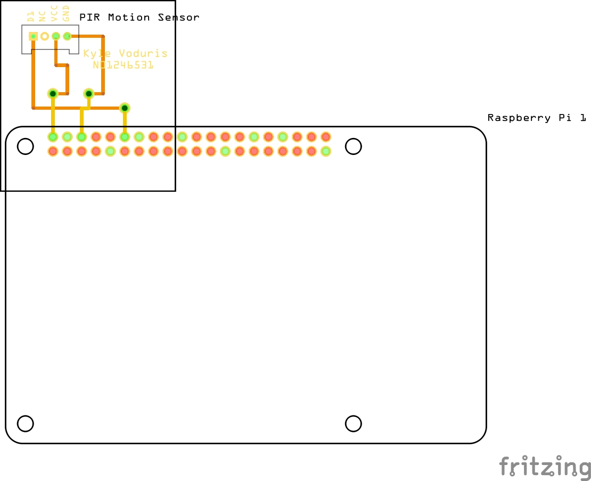

<html>

<h1>Blog For CENG 317 - Lumi Monitor</h1>

	
<h2>PCB Soldered - 09/11/2019</h2>

This week I soldered sockets onto my PCB board so that I can connect my sensor to it and so that the board can connect to the Raspberry Pi. I also solderd wires into the through-holes to connect the top side of the board to the bottom. During the process of soldering I ran into a few issues. The first issue I ran into was I mistakenly soldered both of the sockets to the wrong side of the PCB. I used the desoldering pump to re-solder my sockets corrects. However when I went to check the board by using a multi-meter the resistance showed overloaded, meaning something is wrong with the connections on the board. The connections seemed correct and soldered properly with no shorts; I believe I may have damaged my board during the proccess of desoldering and resoldering. I decided to print another board and tried to solder again. The process on soldering the second board went smoothly and the multi-meter showed proper results. In terms of my budget, I ordered and recieved my USB to Ethernet Adapter from Amazon so that I can easily SSH into my Pi. The cost has been updated on my budget. The Female Header Connector was provied from the prototype lab and cut down fit the specifications of the PCB. My project became slightly off track when I had to print and solder another PCB board, but now that this step is complete, the project is on schedule.
  
 

						  
	
<h2>Breadboard Milestone - 30/10/2019</h2>

This week I put my breadboard design into fruition by wiring up my PIR motion sensor to my Raspberry Pi. The process of wiring went smoothly, however I had trouble getting my sensor to work on the Raspberry Pi. I decided to write my test code out in Python. I chose to use Python due to its simplicity and compatiblity with the Pi. The problem was, I have a lesser knowledge in Python so I had some trouble getting the program up and running, therefore putting the project a day behind. I was able to get two Python programs working to demonstrate the funtionality of my motion sensor. The first program I made checks each iteration of the loop to see if the output on the sensor is HIGH or LOW. The problem with this code was that the IDE I was using to compile the code had trouble keeping up with the output and did no display the results properly. When the code was ran though the terminal it worked fine. The second code slows this down so it only checks the sensor output every 0.1 seconds. The two programs can be found here:
<a href="Software/motion.py">motion.py</a>, <a href="Software/motion2.py">motion2.py</a>.

 

 

I also sent my gerber files to the prototype lab to get my PCB made. I got my PCB made twice since I made some minor adjustments to the wires on the board. Now that I've completed the breadboard milestone my project is now back on track with project schedule. In terms of the budget, I've had to add more costs. Like mentioned in the previous post, I had to buy sockets to connect my motion sensor to the PCB. I will also need to purchase a USB to ethernet adapter so that I can SSH into my Raspberry Pi from my laptop. I tried to save money on the budget by skipping out on this, since I thought that the monitors in the lab had an HDMI port to display the Pi. I will add the cost to the budget when I order it.

 

	
<h2>Breadboard and PCB Design - 15/10/2019</h2>

Designed the breadboad and PCB for the Grove PIR Motion Sensor. Fritzing did not have the Grove PIR Motion sensor
included in the list of parts; I couldn't find a PIR Motion Sensor Part with 4 Pins online either. Instead, for the                     diagrams I used the Grove Light Sensor. It has the exact same pin layout as the Motion Sensor using the same connector. I was able
to edit the breadboard view in a program called InkScape to represent the motion sensor better.

		
<h3>Breadboard</h3>

 
<h3>Schematic</h3>

 
<h3>PCB</h3>

 
<h3>Fritzing Files</h3>

<a href="https://github.com/KyleV1999/LumiMonitor/blob/master/Electronics/LumiMonitor_MotionSensor.fzz">Fritzing File1</a> 
<a href="https://github.com/KyleV1999/LumiMonitor/blob/master/Electronics/LumiMonitor_MotionSensor2.fzz">Fritzing File2</a>

		
			
<h2> Additonal Purchase & Recieve Products - 8/10/2019</h2>

The items that I purchased below were delivered. I setup the Raspberry Pi with an operating system. In this case
Raspian with kernal 4.19, installed on my 32GB micro SD card. I also configured SSH and VNC viewer so I can connect and control the     Pi remotely. I also forgot to purchase a socket for my motion sensor so that it can connect to the PCB. I puchased 10 <a href           ="https://bit.ly/32it9vh"><u>Seeedstudio Grove 4-pin Connectors</u></a>

		
 .

<h2>Purchases - 29/09/2019</h2>

Purchased <a href="https://bit.ly/2kKx8QV"><u>Grove PIR Motion Sensor</u></a> and <a href="https://amzn.to/2kMYDtb"><u>Raspberry Pi 3 B+ Motherboard</u></a>

		
<h2>Created Budget and Met With Collaborator - 24/09/2019</h2>

Today my group and I met with our industry collaborator here at Humber College. He agreed with our ideas to design the Lumi monitor into a mobile. He also agreed with the sensors we are using and gave me the idea to use my motion sensor to record hands free feeding data. Finally he showed us a previous prototype of the Lumi Monitor. Our group decided to use the Raspberry Pi as a development platform. My group also came up with an individual budget for our project which can be found <a href="https://github.com/KyleV1999/LumiMonitor/blob/master/Documentation/Lumi%20Monitor%20Budget.pdf"><u>here</u></a>.	

				
<h2>Constructed Project Plan and Schedule - 17/09/2019</h2>

 <a href="https://github.com/KyleV1999/LumiMonitor/blob/master/Documentation/Project%20Schedual.pdf"><u>Detailed Schedule Here</u></a> This is an estimated schedule / time frame my group will try to stick to when developing the Lumi Monitor over the next two semesters.

		
		
<h2>Hardware Proposal - 10/09/2019</h2>

	This is the original proposal for our project. This outlines our original ideas for the project, project background and infromation about the sensors we plan to use:
		 <a href="https://github.com/KyleV1999/LumiMonitor/blob/master/Documentation/ProposalContentKyleVodurisRev03.pdf"><u>Project Proposal Content</u>
		 <a href="https://github.com/KyleV1999/LumiMonitor/blob/master/Documentation/ProjectProposalKyleVodurisRev03.pdf">
	<u>Project Proposal</u></a>

				
<h2>Repository Created - 05/09/2019</h2>

<a href="https://github.com/KyleV1999/LumiMonitor"><u>https://github.com/KyleV1999/LumiMonitor</u></a>

		
		

			

	
		

